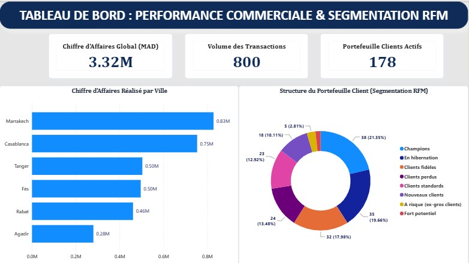

# Analyse du Comportement Client & Performance des Ventes (Projet End-to-End)

## Présentation du Projet
Ce projet est une solution complète d'analyse de données (*End-to-End*) appliquée au secteur du Retail. L'objectif est d'extraire, de modéliser et de visualiser les données transactionnelles afin de comprendre les dynamiques d'achat, d'analyser la répartition géographique des ventes et de segmenter la clientèle selon le modèle **RFM (Récence, Fréquence, Montant)** pour piloter la performance commerciale.

## Stack Technique
* **Base de données & Extraction :** SQL Server (SSMS) — Modélisation relationnelle et vues d'agrégation.
* **Analyse Exploratoire (EDA) & Scoring :** Python (Pandas, NumPy, Matplotlib, Seaborn) — Analyse de distribution et segmentation RFM.
* **Business Intelligence & Restitution :** Power BI — Modélisation des données, mesures DAX et tableau de bord exécutif.

## Architecture du Répertoire
* **`01_Data/`** : Jeux de données bruts et nettoyés (fichiers CSV et Excel).
* **`02_SQL_Scripts/`** : Scripts de création de la base, requêtes KPI et vue de segmentation RFM.
* **`03_Python_Analysis/`** : Notebook Jupyter contenant l'exploration statistique (EDA) et le calcul des scores RFM.
* **`04_PowerBI_Dashboard/`** : Rapport Power BI interactif (`.pbix`) et capture visuelle du tableau de bord.
* **`requirements.txt`** : Liste des dépendances Python requises pour exécuter l'analyse.

## Aperçu du Tableau de Bord

## Principaux Enseignements Métier (Insights)
* **Performance Globale :** Chiffre d'Affaires réalisé de **3,32 M MAD** sur **800 transactions**, généré par **178 clients actifs**.
* **Concentration Géographique :** L'axe **Marrakech** (0.83M MAD) et **Casablanca** (0.75M MAD) représente près de la moitié du chiffre d'affaires global.
* **Segmentation Client (RFM) :**
  * **Champions (21,35%) :** Cœur du chiffre d'affaires, clients à fidélité et valeur maximales.
  * **Clients Fidèles (17,98%) :** Revenus récurrents et stables.
  * **En Hibernation & Perdus (~33%) :** Base inactive représentant une opportunité de réactivation via des offres ciblées.

## Guide d'Exécution
1. Exécuter les scripts SQL du dossier `02_SQL_Scripts/` dans SSMS pour générer la structure et les vues.
2. Ouvrir le notebook dans `03_Python_Analysis/` pour explorer les visualisations statistiques.
3. Lancer `Dashboard_Comportement_Client.pbix` dans Power BI Desktop pour manipuler les filtres et les métriques de vente.

---
*Projet réalisé par **Mohamed Alakhouch** dans le cadre d'un portfolio en Data Analytics.*
